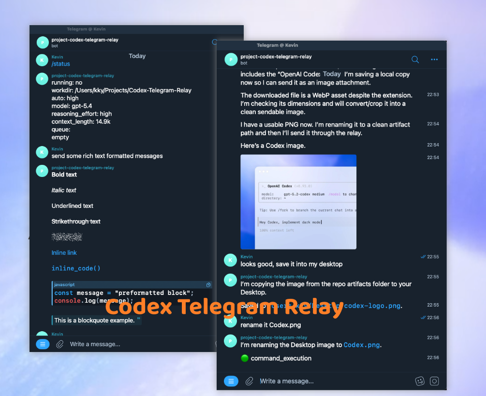

# AnyAgent

[](https://github.com/kky42/anyagent/actions/workflows/ci.yml)
[](https://www.npmjs.com/package/@kky42/anyagent)

[English](./README.md) | [简体中文](./README.zh-CN.md)

把 Codex、Claude 或 Pi 直接带到 Telegram 或 Mattermost 里用。

AnyAgent in Telegram



## 为什么选 AnyAgent

- 直接复用你本地已经配好的 CLI agent 和配置，在 Telegram 或 Mattermost 聊天里继续用，无需迁移。
- 支持 streaming events 实时输出，agent 当前状态随时可见。
- 完整的聊天命令，让聊天里的体验接近本地 CLI。
- 只注入 7 行附件协议，低侵入，尽量保留原生 agent 的行为和性能。

## 快速开始

全局安装 AnyAgent：

```bash
npm install -g @kky42/anyagent
```

先用 [BotFather](https://t.me/BotFather) 创建一个 Telegram bot，或创建 Mattermost bot account 和 access token，然后创建 AnyAgent profile：

```bash
anyagent add main codex
```

编辑生成的配置文件：

```bash
~/.anyagent/agents/main/config.json
```

填入聊天平台 bot 凭证、允许访问的 username，以及本地 workdir。

启动 relay：

```bash
anyagent
```

打开你的 Telegram 或 Mattermost bot，在 Telegram 发送 `/status`，在 Mattermost 发送 `!status`：

```text
/status
!status
```

## 配置

每个 profile 都位于 `~/.anyagent/agents/<profile-name>/`。

较完整的配置示例：

```json
{
  "profile": {
    "cli": "codex",
    "workdir": "/Users/you/projects",
    "auto": "medium",
    "model": "default",
    "reasoningEffort": "default"
  },
  "bindings": {
    "telegram": {
      "allowedUsernames": ["your-telegram-username"],
      "groupHistory": {
        "hours": 24,
        "messages": 1000
      },
      "bots": [
        {
          "username": "your_bot_username",
          "token": "YOUR_TELEGRAM_BOT_TOKEN"
        }
      ]
    },
    "mattermost": {
      "allowedUsernames": ["your-mattermost-username"],
      "groupHistory": {
        "hours": 24,
        "messages": 1000
      },
      "bots": [
        {
          "serverUrl": "https://mattermost.example.com",
          "username": "your_bot_username",
          "token": "YOUR_MATTERMOST_BOT_TOKEN"
        }
      ]
    }
  }
}
```

重要字段：

| 字段 | 含义 |
| --- | --- |
| `profile.cli` | 要运行的本地 agent CLI：`codex`、`claude` 或 `pi`。 |
| `profile.workdir` | agent 使用的本地工作目录。必须是已存在的绝对路径或 `~/...`。 |
| `profile.auto` | agent 执行动作时的权限等级：`low`、`medium` 或 `high`。 |
| `profile.model` | 可选的模型覆盖配置。使用 `default` 表示沿用 CLI 默认值。 |
| `profile.reasoningEffort` | 可选的 reasoning 覆盖配置。使用 `default` 表示沿用 CLI 默认值。 |
| `allowedUsernames` | 允许使用这个 bot 的聊天平台 username。 |
| `groupHistory.hours` | 群聊上下文的小时窗口。默认 `24`。 |
| `groupHistory.messages` | 群聊上下文的已观察消息数量窗口。默认 `1000`。 |
| `bots[].token` | BotFather 提供的 Telegram bot token。 |
| `mattermost.bots[].serverUrl` | Mattermost server 的基础 URL。 |
| `mattermost.bots[].token` | Mattermost bot access token。 |

`groupHistory` 整个配置块是可选的。如果省略，AnyAgent 会使用上面列出的默认值。

如果你不知道自己的 Telegram username，先给 bot 发送任意消息。未授权回复里会显示需要加入配置的标准化 username。

## Telegram 群聊

在群聊里，AnyAgent 只会在消息明确提到 bot 时运行，例如 `@your_bot_username summarize this`。

触发后，agent 会收到已观察到的群聊上下文和当前触发消息。上下文受 `groupHistory.hours`、`groupHistory.messages` 和上一次触发边界限制，所以已经发给 agent 的消息不会在下一次触发时重复发送。历史上下文里的附件只显示元信息。relay 只会下载触发消息和它回复的消息里的附件。

Telegram Bot API 不能读取任意历史群聊消息。daemon 重启后，AnyAgent 的已观察群聊历史会从空开始。如果 bot 开启了 Telegram Privacy Mode，Telegram 可能只投递命令、提及 bot 的消息和对 bot 的回复；如果需要更完整的观察上下文，需要关闭 Privacy Mode 或把 bot 设为管理员。
Telegram bot 也收不到其他 bot 发出的消息，所以同一个群里的一个 bot 不会因为另一个 bot 的发言而触发。

## Mattermost 聊天

在 direct message 里，每个 Mattermost channel 对应一个 agent session。在普通 channel 和 group message 里，每个 channel 也对应一个 session，只有明确提到 bot 的消息才会触发 agent。

Mattermost thread reply 不会创建独立 session。relay 会继续使用 channel session，并通过 `root_id` 把 agent 回复发回对应 thread。

Mattermost 输出使用原生 Markdown 渲染，包括表格和 fenced code block。relay 会用 Mattermost post edit 显示 transient progress，并用 WebSocket typing indicator 表示运行中。
和 Telegram 不同，Mattermost bot account 可以收到同一 channel 或 thread 里其他 bot 发出的 post。AnyAgent 仍会忽略自己发出的 bot post；但如果多个 AnyAgent bot 共享一个 channel，一个 bot 可以在上下文里看到另一个 bot 的回复，并且在被明确提及时可能被其他 bot 的消息触发。

## 聊天命令

Telegram 命令使用 `/`。Mattermost 命令使用 `!`，因为 Mattermost 会先处理 `/` slash command；除非另行配置 slash-command integration，否则这类命令不会投递到这个 WebSocket relay。

| Telegram | Mattermost | 用途 |
| --- | --- | --- |
| `/status` | `!status` | 查看当前状态、CLI、workdir、配置、context length 和排队消息。 |
| `/cli` | `!cli` | 查看或切换当前 CLI。 |
| `/workdir` | `!workdir` | 查看或切换当前工作目录。 |
| `/auto` | `!auto` | 查看或切换权限等级。 |
| `/model` | `!model` | 查看或切换模型覆盖配置。 |
| `/reasoning` | `!reasoning` | 查看或切换 reasoning effort。 |
| `/abort` | `!abort` | 停止当前运行，并清空排队消息。 |
| `/new` | `!new` | 为当前聊天启动一个新的 agent session。 |
| `/reset` | `!reset` | 从磁盘重新加载配置，并清除当前聊天的覆盖配置。 |
| `/clear_cache` | `!clear_cache` | 删除当前聊天的附件缓存。 |

示例：

```text
/cli claude
/workdir ~/projects/my-app
/auto high
/model default
/reasoning high
!cli claude
!workdir ~/projects/my-app
!auto high
!model default
!reasoning high
```

## 使用 PM2 持久部署

如果希望 AnyAgent 常驻后台运行，可以全局安装 AnyAgent 并用 PM2 管理：

```bash
npm install -g @kky42/anyagent pm2
pm2 start anyagent --name anyagent
pm2 save
```

常用 PM2 命令：

```bash
pm2 status
pm2 logs anyagent
pm2 restart anyagent
pm2 stop anyagent
```

更新 AnyAgent 并重启 relay：

```bash
npm install -g @kky42/anyagent@latest
pm2 restart anyagent
pm2 save
```

## 说明和限制

- relay 启动时会丢弃停止期间收到的消息。
- 支持 Telegram 和 Mattermost 聊天。群聊或 channel 消息必须提到 bot 才会触发运行。
- Telegram 支持的附件类型：照片、文档、视频、音频、语音消息和动画。Mattermost 支持文件附件。
- 超过 20 MB 的附件会被拒绝。
- 通过 slash command 修改的配置只影响当前 chat session。
- 本地配置和运行时文件位于 `~/.anyagent/`。

## 从 codex-telegram-relay 迁移

包名和本地运行目录已经变更。

如果需要保留旧配置，请移动到：

```bash
~/.anyagent/agents/<profile-name>/config.json
```
